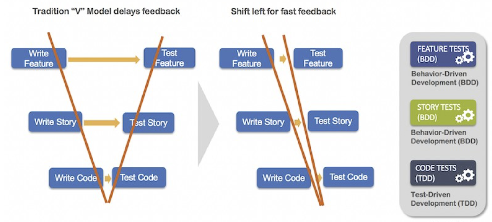

# Refactoring

Refactoring ist eine disziplinierte Technik um bestehenden Code intern umstrukturieren, ohne das
externe Verhalten zu verändern. Meist sind es kleine Veränderungen die aber eine signifikante
Verbesserung der Les-, Wartbarkeit oder ähnlichem mitsichbringt. Weil die veränderte Einheit auch
sehr klein ist, ist die Wahrscheinlichkeit das etwas schief geht sehr klein. Das System wird so
verändert, dass es trotzdem immer noch voll funktionsfähig ist.

> Ziel ist es den Source Code mit kleinen Schritten zu verbessern. Kleine Änderung - kleine Auswirkung, aber stetiges Improvement!

Durch das kontinuierliche Verbessern des Codes wird immer einfacher um damit zu arbeiten. Dadurch
ist er einfacher wartbarer und erweiterbar.

* Wieso: Les- und Wartbarkeit des SourceCodes verbessern
* Wer: jeder Developer macht es
* Wann: jederzeit
* Wo: Jeder Code der modifiziert oder geschrieben wird (nicht irgendwo)

Vor neuen Feature, erst Refactoring machen. Dann mit neuem Feature starten

## Reality

Refactoring gibt es seit Jahrzehnten. Obwohl viele Rezepte vorhanden, wird es oft nicht konsequent
gemacht. Wieso? - unverständlich, unprofessionell

Es hat früher oder später Konsequenzen wenn man es unterlässt.

## Misconceptions

Man muss nicht fragen müssen und man braucht dazu keine Backlog Item. Es ist keine spezielle Aufgabe
welche im Projektplan auftaucht. Gut gemacht, ist es eine reguläre Aufwand der Programmierung.

Es ist ein Mindset, will ich Qualität liefern oder möchte ich reparieren.

## Simplistic Refactoring

* Code wird nach Coding Guidelines formattiert
* Gute Qualität von Methoden- und Variablennamen
* Import/Using directives sind aktuell
* keine auskommentierter Code -> dazu gibts Git
* keine TODO, FIXME's
* keine leeren Methoden
* keine leeren Catch-Blöcke

## Mechanical Refactoring

Automatische Verbesserungen durch die IDE. Kein Risiko um den Code zu brechen. Immer machen, wenn
eingeblendet. Jede kleine Änderung committen. IDE sollte Hinweise liefern, was verbessert werden
soll.

* renaming über das ganze Projekt
* Verschieben on anderes Package
* Parameterliste ändern, Name oder Typ
* Methoden, Klassen extrahieren

### Typical Mechanical Refactoring

* Umbenennen
* Verschieben
* Extrahieren
* Inline
* Signatur ändern
* Delegate
* überflüssige Keywords entfernen
* erweiterte Loops verwenden
* Streams verwenden
* Methodenreferenzen verwenden
* Try with resources verwenden
* multiple exception in catch
* unchecked exceptions verwenden
* usw.

Typisch heisst nicht trivial. Etwas schwieriges sind Namen. Er sollte beschreibend sein.

### Advanced Refactoring

Code so verändern, damit er verbessert wird. Dazu braucht man die Garantie, dass Code genau gleich
funktioniert. TDD und ATDD (acceptance TDD) sind ein muss. Dazu braucht es min. 60% Test-Coverage
für ein angemessene Sicherheit.

## Refactoring Examples

eher bei Java

* nie public fields
* keine Parameter als lokale Variablen nutzen
* nie `null` retournieren, sonder Empty List oder `optinal`
* Standard Bibliotheksklassen und Exceptions nutzen
* Private Prädikatmethoden anstatt komplexen if-conditions nutzen -> extrahieren
* Loops mit Streams ersetzen
* Conditions mit filter ersetzen
* Immutable Klassen bevorzugen
* keine checked exceptions

## TDD - Test Driven Development

1. Test schreiben
1. code schreiben
1. testen
1. fail
1. korrigieren
1. pass

## Legacy Code Unit Testing

Jeder bestehender Klasse kann ein Unit Test hinzugefügt werden:

1. Kontext definieren/bauen wie Methode aufgerufen werden kann
1. Letztes Statement (Condition) (ganz rechts) in der Methode testen, Parameter daraus setzen und
   testen
1. Test mit zweiter Condition von rechts erweitern
1. dann ein Step hoch

## The Modern Way of Testing

Shift left for fast feedback

{width=40%}

## Refactoring Catalog

[Online Refactoring by Martin Fowler](https://refactoring.com/catalog/)

> Es ist eine Sünde Refactoring-Gegenheiten verstreichen zu lassen, vor dem Pushen der Changes
> 
> -- Marcel Baumann