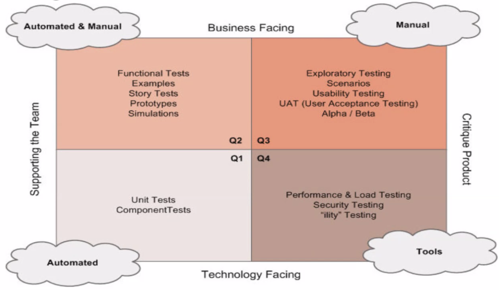

# Quality Attributes of Software Architecture

Architektur ist eine Hypothese, welche durch die Implementation und einer Messung prüfbar wird.

> The only way to go fast, is to go well.
>
> -- Robert C. Martin

## Characteristics

Änderungen sollten günstig sein. Feedback Loop sollte implementiert sein - Design/Development sind
empirische Aktivität. Keine Spekulationen machen, weil nur unnötig Komplexität hinzugefügt wird.
Immer an *drei* Dinge denken (Risiken), die schiefgehen können. In *kleinen* Teams arbeiten, um *gute*
Software zu produzieren.

## Functional Requirements

Anforderungen sollen **[Requirements - SMART][]** definiert sein.

## Stories as Functional Requirements

Stories müssen **[Stories - INVEST][]** sein.

### Stories

Als *Rolle* möchte ich *Ziel/Wunsch*, um *Nutzen*. 

**Akzeptanzkriterien**

* Kriterium1
* Kriterium2

Eine Story wird erzählt, sodass eine Diskussion gestartet werden kann. Daraus ergeben sich Umsetzungen.

### Use Cases

Use Cases sind tot - viel zu Papierlastig, sollte vergessen werden.

* related Use Cases sind Epics
* Primary Actors sind Personas
* Main Scenario sind Stories
* 

### Validation

TDD ist ein Sicherheitsnetz für Refactoring und Dokumentation. ATDD auf Stufe Subsystem-Level oder System Level mit Java Modules (ArchUnit). User Interface Tests, Selenium - minimal halten – Sind umständlich.

### Testing Quadrants

{width=50%}

### Testing Pyramid

Möglichst alle Tests automatisieren. 

## Architecture Goals

* Komplexität *reduzieren*
* Änderbarkeit *steigern*
* Paralelle Entwicklung *ermöglichen*

drei Paradigmen: strukturiert, objekt-orientiert und funktional

## Quality Attributes

* lose Kopplung
* hohe Kohäsion
* Design für einfache Änderungen
* Separation of Concerns
* Information Hiding (DTOs zestören es)
* Good Practices; DDD, legibility of artifacts, git, Infrastructure as Code
* Abstraktion
* Modularität
* Verfolgbarkeit
* Betriebskosten minimieren (DevOps) - tracing, logging, monitoring
* Selbst dokumentierend - Clean Code *und* JavaDoc
* Incremental Design

## How to reach these Goals?

* Spikes
* Experience and ask experts
* Codified knowledge
* Copy, modify, mutate, improve
* Refactor
* Unlock collective wisdom - fragen im Internet (Foren) stellen
    - bei fragen Fragen!
    - BugReports/Change Requests stellen
    

## Quality Citations

* Lowering quality lengthens development time
* Die Codequalität is invers proportional zum Effort um ihn zu verstehen
* Guten Code cleveren Code bevorzugen
* schlechte Qualität verhindert Performance

## Refelction

* Wie kann  ich schneller lernen?
* Was kann im Team geändert werden, um uns zu verbessern? - wie kann Risiko minimiert werden
* Wie können wir besere Produkte liefern?
*  wie kann die Qualität gesteigeert werden?

