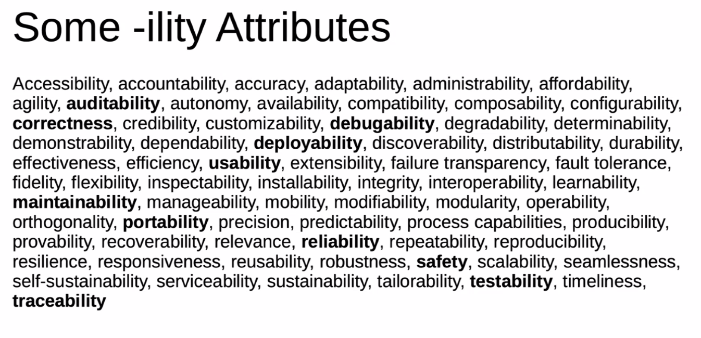

# -ility-Attributes

Non-functional Requirements wie Scalability, Performance Efficiency, Security, Reliablity usw.

## Truths

Funktion muss erfüllt sein und korrekt laufen.

> Build the right product, build the product right
>
> -- unbekannt

Anforderungen definieren nicht User und Kunden, sondern sie äussern *Wünsche*. Technische Umsetzung,
wie Wunsch umgesetzt wird, damit Wunsch erfüllt wird ist unsere Sache. Validation (Architect ist
Berater) und Verifikation (Architekt ist Bestimmer) der Anforderung im Auge behalten.

Weil Akzeptanztest die Requirements prüfen ist sichergestellt, dass Anforderung erfüllt werden.
Reine Metriken bringen wenig, Argumentationskette ist wichtig.

Scrum ist empirisch-, Resultat-driven. Etwas versuchen, prüfen und Erkenntnisse sammeln und
Entscheide ableiten.

*ATAM* ist zu langsam und ist sehr teuer - sowohl auch *architecture driven design*. Manuelle
reviews sind obsolet, keine pull requests weil langsam und daher teuer. Sinnvoll ist pair-work (
virtuell oder co-located).

## Non-Functional Requirements

Jedes hat folgende Inhalte

* Context (Zeitraum, Wo - Kunde, intern, usw.)
* Warum
* Muss messbar sein (benutzerfreundliches UI, System muss schnell sein sind schlechte Requirements)
* Minimalen Wert
* Optimalen Wert
* Maximalen Wert - overenginerd

Für Werte ist besseren Ansatz; in 95% der Anfragen sind unter 0.5s, 98% sind unter 1s, usw..

Sammlung der ility-Attribute der letzten Jahre.

{width=50%}

## Fitness Functions

Sind die Units-Tests für non-functional Requirements. Ist Mischung aus Umsetzung, Analyse und xxx
mit Fitness Functions kann Analyse verifiziert werden.

todo: erklärung hier
einarbeiten. https://www.thoughtworks.com/insights/articles/fitness-function-driven-development

Führt zu *double loop architecture* ist ein Prozess welcher sicherstellt, dass die Architektur dem
Businessnutzen widerspiegelt.

Beispiele für Fitness Functions

* Static code analysis (Security, ...)
* Unit test frameworks
* Penetration testing
* load testing
* monitoring tools
* logging

## Assumptions

Architektur, wie Business Kapazitäten und Infrastruktur wird in Code ausgedrückt durch den Nutzen
von Fitness Functions. Diese bestehen aus *Code* und werden als Teil des CI/CD oder Monitoring
ausgeführt.

### Combining Fitness Functions

* Atomic + triggered: ArchUnit rules während CI
* Holistic + triggered: komibiniert security und Scalability (das ganze System wird getestet)
* Atomic + continual: Test REST endpoints Verbs und Error-Messages (durch heartbeat)
* Holistic + continual: Test Resilienz

Triggert eher in CI/CD, Continual

### Functions Examples

* Code Quality in SonarQube messen, Qualität in SQ konfigurierbar
* UAT (User Acceptance Test) darf nicht zwei Versionen vor der Prod-version sein
* Keine Geheimnisse in Git - OWASP
* Security Testing Stage
* Deploy mit einem andere Application-Service Account
* zwei Approver vor dem Release in Produktion

Fitness Function sind auch Teil der Produktionsumgebung. Auch für heikle Daten - dafür gibt es
Geheimhaltungsklauseln.

Geben Auskunft über

* Mean Time between Failures
* Max Time to Recover (wichtigstes Kriterium in agilen Umfeld)
* Response Time
* Latency in your network (grossen impact auf Architektur)
* Resource usage (was ist Nutzlast, Spitzen?), lohnt sich mehr HW-Ressourcen oder mehr Leute

In Produktion erhalten wir wertvolle Informationen, die in die Entwicklung zurückfliessen sollten.
Damit Produkt besser wird.

## Code Quality

* Modifiability
* Manageability
* Adaptability
* Legibility (lesbarkeit, wie messbar? z.B. kein Typo in Kommentar, wenn  international dann englisch )

## Resilience and Operability

* Stability
* Resiliency
* Availability
* Recoverability

## Performance and Security

* Scalability
* Stability
* Response Time
* Security

## Micro Profile

Von Java zur Verfügung gestellt, z.B. Open API, Rest client, Heath, Jakarta, Streams, usw.
