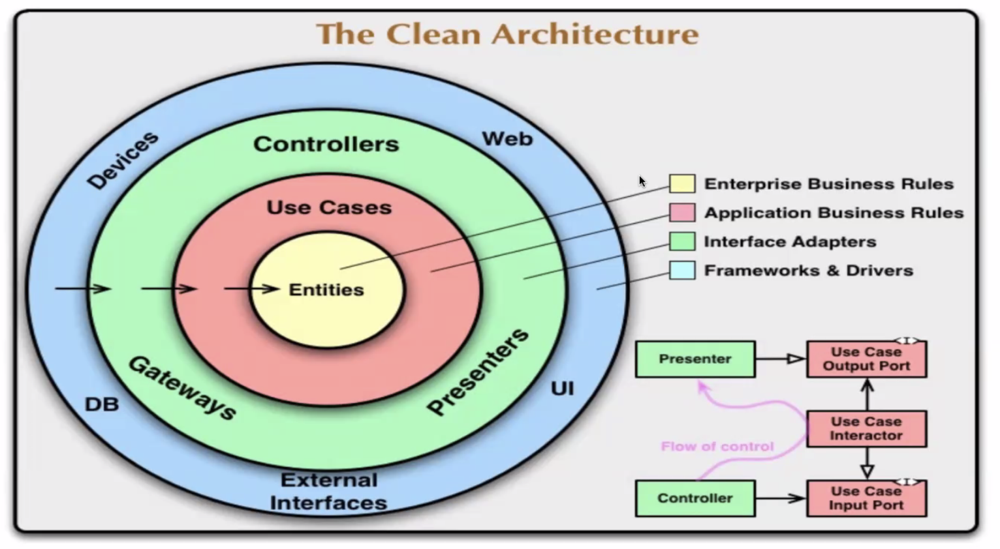
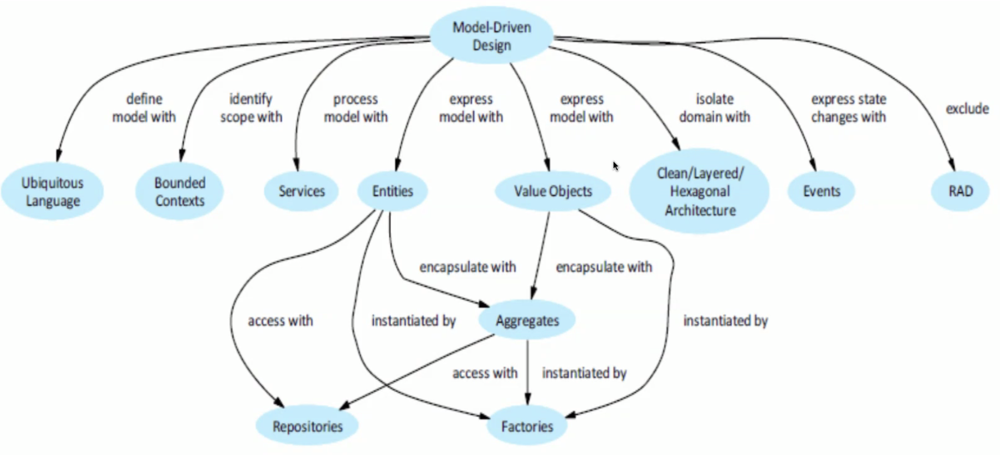

# Architectural Trends I

Aktuelle Trends in Schweiz und Europa.

## Truths

* Agile Architektur entsteht während der Entwicklung
* Agile Architeektur entwickelt sich
* Architektur ist für die Technologie/Infrastruktur relevant bzw. abhängig (Mobil First, FatClient)
* Nicht alle Architekturaspekte sind Technologie relevant (Reliability)
* SOA ist tod - ist nicht angepasst auf multi-verteilte Firmen Workflow/Orchestration nicht möglich
  über mehrere Standorte
* Monolithische Lösungen müssen vorsichtig angewandt werden - Modular Monolith Solution wäre ein
  guter Ansatz
* Applications sind häufig mobile first oder Browser first - PWA!
* Browser Lösungen müssen oft neu geschrieben weerden - alle 18 bis 24 Monate

## Domain Driven Design

Fokus ist die fachliche Domäne anstatt die technische Welt. Man muss Benutzer und seine Sprache
verstehen. Der Code reflektiert das Benutzermodel.

## Hexagonal or Onion Architecture

Hexagonal kommt aus OpenSource/Java Ecke, Onion aus .net die Idee ist aber dasselbe.

{width=50%}

## Domain Driven Development

* Man spricht Benutzersprache, Klassen und Methode entsprechen der Domainlanguage
* Bounded Domains - in Subsysteme aufteilen
* benötigt aber klares Interface zwischen Bounded Domains
* Definition of Shared Kernels - Shared models wenn möglich vermeiden - Domains müssten sonst immer
  von allen direkt übernommen werden.

## Domain Ubiquitous Language

Es braucht eine *gemeinsame* Sprache zwischen Kunde und SourceCode.

{width=70%}

## Domain Driven Design

* Entitäten haben Identitäten  (und einen Zustand, Verhalten)
* ValueObjekte (Adressen/Telefonnummer) haben keine Identität, sie tragen nur Informationen.
* Aggregate - ver-/binden Entities und ValueObjects
* Repositories speichern Entitäten und ValueObjects
* Factories erstellen Entities und ValueObjects
* Ein Service hat keinen Zustand, sondern *nur* ein Verhalten auf Objekten.

## Domain Events

Events werden in Vergangenheit definiert (es wurde gebucht) und lösen einen Command aus.

* Event - Etwas hat sich geändert (Order Placed)
* Command - Objekt wird an Command-Handler geschickt (Place Order)

## Multiple Teams

Mit DDD bzw. Bounded Domains kann die Arbeit parallelisiert werden. Änderungen (in einer Domäne)
können unabhängig voneinander gemacht werden.

## Immutability and Functional Style

* Entity Objekte sollten eine nicht änderbare Identity
* ValueObjekte sollte nicht änderbar sein -> man mutiert (erstellt neue). Dadurch überrascht man
  niemand (Record Konzept von Java)
* Alle Werte werden beim Erzeugen gesetzt

## Questions

* *What is an identity?*    
  Etwas das nicht ändert (eduId)
* *Why should value object be immuable?*    
  Um andere Services nicht zu überraschen die mit dem gleichen Objekt arbeiten
* *Why is a bounded context important?*   
  Es handelt sich um fachliche abgegrenezte Eeinheiten
* *Why is contituous Integration a ceentral activity?*  
  Durch viele kleine Änderungen benötigt man schnelles Feedback auch um schnell allfällige Fehler zu
  finden.
* *Reflect about Domain Specific Languages DSL*
  DSL codifiziert eine Domäne, die Sprache der Benutzer

### DDD Anti-Patterns

* Anemic Domain Objects
* Repetitive DAO's - Data Access Object
* Fette Service Layer wo Service-Klassen alle Business Logik enthalten
* Feature Envy: Methoden sind zu inteeressiert an Datene von anderen Klassen

## Event Storming - Ignite your DDD

* Start beim Domain Event - Was passiert im System
* Was triggert diesen Event? -> Command
* Das Read-Model zeigt etwas an

{width=70%}

## Micro Services

* Mapping Bounded Domains und Microservices
* Informationsaustausch über JSON oder Protobuf (wenn JSON zu langsam)
* REST Services
* GraphQL services (erst wenn REST zu langsam)
* asynchronous service
* reactive systems (erst am Schluss - schwierig zu debuggen und Support im Betrieb wird teurer)
    - Event based
    - Eventual consistency

* difficulties: latency, Netzwerkstabilität, Bandbreite ist erschöpflich, Netzwerk sollte sicher
  sein, Topologie ändert, es gibt mehrere Administrator, Tansportkosten, Homogenes Netzwerk

* User Interfacee sind schwieriger
    - micro user interfaces
    - GraphQL
* Logging ist schwieriger
    - ELK nutzen - Elasticsearch, logstash, Kibana

## Ball of Mud

Grosser Ball an Verknüpfungen und Abhängigkeiten in einem System.

## Monolith to Modular

1. Grossen Service und dessen Klassen als separate Solution oder Modul auslagern
1. Bounded Domain definieren
1. Gespeicherte Daten in ein eigenes Schema migrieren
1. Deploy als separaten Micro Profile Service

## Refactor

Aggressiv und wiederholend Refactoring betreiben.

## Evolvable Architecture

1. Dimensionen die von Evoltion betroffen sind identifizieren
1. Fitness Functions pro Dimension definieren
1. Deployment Pipelines um Fitness Funktionen zu automatisieren
1. Starte mit der Weiterentwicklung

## Wisdoms

Das *business problem* muss verstanden sein. Je mehr wiederverwandbar der Code ist, umso
weniger verwendbarer ist er. Lieber kopieren, statt Vererbung. COTS (Commercial off-the-shell)
-Lösungen wenn man agil sein will. Frameworks vermeiden, aber Bibliotheken verwenden. Nutzlose
Variabilität (mehr Plattformen, mehr DBs unterstützen) vermeiden.

Bester Ansatz für Architektur ist eine *Monolithischer Architeckt*, günstiger, weniger komplex und schnellere Zyklen.

Um Modularität zu garantieren Java Module oder ArchUnit verwenden.

Die Speicherung muss auch modular aufgebaut sein (mehrere Schemas)

