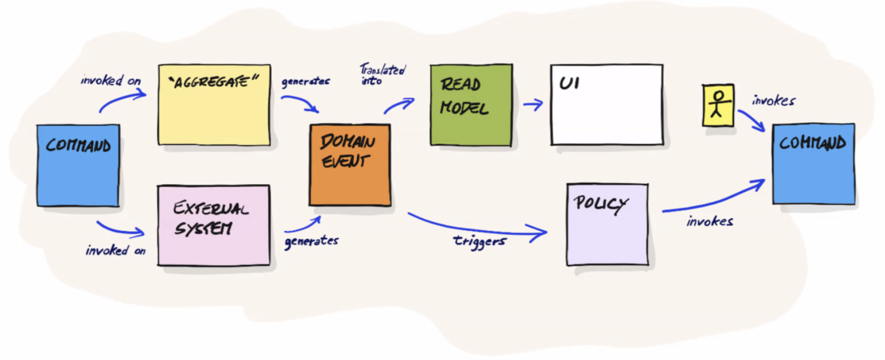
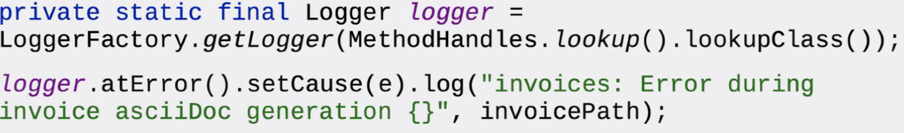

# Architecture Trends II

## Truths

* *Make* oder *Die* (weil der Kunde kein Unterschied von Branding usw. erkennt ist Bindung sehr
  klein) ist das neue Game
* Vendor anti-pattern - Standardlösungen lösen etwa 80% der Probleme. Die 10% letzten fehlen und
  kann nie umsetzen. (Für eigene Buchaltung ist ok, aber nicht wenn Kunde mit Programm interagiert)
* Der grosse Unterschied (Differenzierung) zwischen Meiner Firma und der Konkurrenz ist wie der
  Kunde via Software Applikationen interagieren.
* je kleiner ein Element der Architektur ist, umso mehr enticklungsfähig ist ees.
* aber je kleiner ein element ist, umso schwieriger ist es zu debuggen, loggen und monitoring
* kein two phase commits transactions

## Assumptions

* SOA ist Tod, Microservies nutzen mit Docker, Helm und DDD. Aber Datentausch via HTTP, da Bruch von
  Netzwerke bei verteilte Standorte message Bus nicht eingesetzt werden kann (Firewalls)
* Enterprise MS ist nur praktizierbar wenn auf Kubernetes
* Lambda Functions ist die nächte Evolution (lambda? check!)
* Docker images nutzen, VMs sind Tod
* Hybride Cloud nutzen -> Installations und Maintenanceekosten prüfen
* Lean thinking gewinnt langfristig
* Sicherheit ignorieren ist der professionelle Tod
* *EVentual consistency* ist die Norm (der Zustand ist leicht verschoben (MS - ))
* *Idempoteent* ist hi (man weiss nicht ob Meldung ankommt oder nicht, requestId)
* *Immutability* is the new kid on the block - wenn er ein Objekt bekommt, ist es anders man weiss
  wenn er hat
* CQRS ist ein wichtiges Design Pattern - beinhaltet implizit Eventual Consistency und Idempotent
* Event Streaming und Event Store sollte darüber nachgedacht werden -> Man kann Geschichte
  wiederherstellen, jede Änderung ist dokumentiert

## Event Sourcing

Rechte Seite ist EventStore.

{width=50%}

## Services

Austausch von Daten über mehrere Services mit JSON. GraphQL optimiert die Latenzzeit (wird REST
ablösen), beinhaltet Typsicherheit und Release Capability und Aggreeegator für Backend Services und
Front-End. API Mesh für grössere Applikation (Netflixgrösse).

## Reactive Systems

Reactive ist ein Set von Design Prinzipien (ähnlich wie REST). Es ist asynchron und versteht den
Unterschied zwischen Event und Message verstehen.

## Security with JSON Web Tokens

* Stateless
* Standardisiert mit RFC 7519
* bietet Authorization
* bietet Information Exchange - auch Stückweise
* SSO
* CORS ist kein Problem mehr

## Domain Specific Languages - DSL

Formalisierung der ubiquitous Language (Kundensprache)

* Fluent API
* Builder Pattern
* Gradle DSL

## Monitoring

Agiler Mindset; Bauen, Testen, Betreiben

* Automatisches Monitoring
* Alarming, Tracing, Logging
* Fitness Functions
* Debugging im laufenden Betrieb
* ELK ElasticSearch, LogStash, Kibana

Monitoring ist auch Architektur, muss berücksichtigt werden.

## Central Logging

Logging ist ein muss. Loggings coding guidelinese und Architekturregeln. Es muss ein zentrales
Logrepository geben. Architektur sollte Fluss deer Events und Commands wiederspiegeln Java internes
Log-System **nicht** verwenden, sondern **slf4j**.

### Logging Concepts

1. Loggers; erfassen die Informationen (Events)
1. Appender; nehmen die Informationen und fügen Sie irgendwo an (sollte nicht in DB sondern file)
1. Layouts; Formattieren konvertieren odeer formatiereen Daten in Log-Messages. Das Layout definiert
   wie die Daten aussehen.

Wenn immer Standardformate (zb. Datum) verwenden.

{with=50%}

Parameter in Logmessage ist effizient, weil es nur Kostet wenn sie effektiv gebraucht wird. Wird
String-CConcatination verwendet wird immere ausgeführt.

Mapped Diagnostic Contect MDC ist ein zentrales Feature für multi-threaded logging. Beinhaltet
Key/Value-Pair pro Thread oder Prozess.

## Auditing

Ist nur ein *compliance* Komponente, hat nichts mit Logging zu tun. Man muss dazu Gesetze und
Empfeehlungen kennen. Ein Audit muss *Menschenlesbar* und *fälschungssicher* sein.

Audit bringt kein Funktionsgewinn für die Applikation und Kunde.

## Persistence

In Java

* Relational Database
    - Embeddeed Database HSQLDB
    - Java Persistence API JPA (ORM-Mapper)
    - JOOQL

* Non-Relational Database
    - Document Databasee
    - MicroStream
    - Serialization (aktuell todgeweiht)

## Hypothesis

Beim Start einer neuen Applikation sollte *modularen Monolith* mit DDD Approach gewählt werden. Wenn
man wächst, kann dann einfacher skaliert werden.

Micro-Architecture Lösung ist teuer beei Wartung und Betrieb, erst wenn wirklich nötig.
