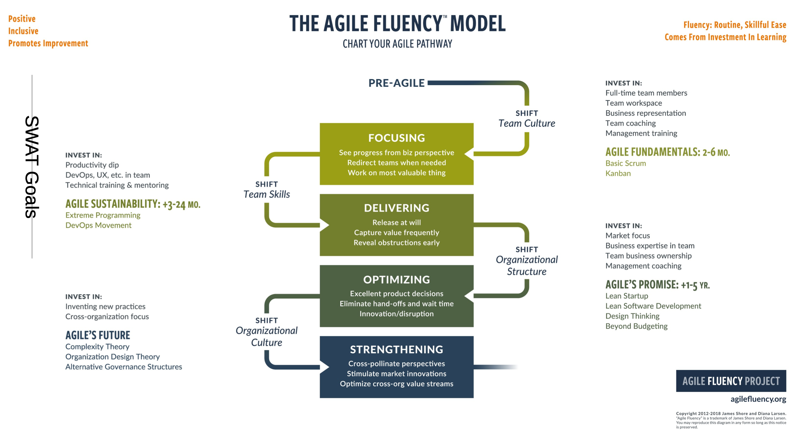

# Team and Technical Excellence for Architects

Ein Architekt leitet technisch, versteht Stakeholder und coached das Team.

## Architect as a Teacher

Lehren ist ein Weg zum lernen. Man muss Gebiet vertiefen um Fragen beantworten zu können. Es ist
zwingend die Menschen im Kurs zu respektieren. Man muss das Lernziel verstehen und eine Strategie
entwickeln um dahin zu gelangen. Psychologie studieren um beste Praktiken zu finden.

## Architect as Lean Leader

* Architektur fördern, nicht erzwingen
* Skills der Mitarbeiter transformieren
*

## Architect as a Coach

Das Team soll besser werden, oberstes Ziel. Dadurch nimmt Qualität allgemein zu. Oft wechselt ein
Coach, wenn Erfolg eingetreten ist (wie im Sport).

## Teaching Techniques

* Community of practice
* Pair programming
* Design workshops
* Coding dojo
* Design und Code review
* Workshop and presentations

### Community of Practice

Sammlung von Leuten mit gleichen Intressen und besser werden wollen. Teilen von Erfahrungen und
Wissen.

### Self-Teaching Techniques

* Artikel oder Tutorials, z.B. Baeldung
* Source Code Beispiele
* Youtube Channels
* Technische Blogs
* Open Source Distributions
* Bücher
* Magazine

### Coding Learning Techniques

* Pair programming
* Open Source Projects
* Refactoring sessions
* Mob programming
* IDE trainings
* Defect driven development

## Five Top Mistakes

By IBM

* Anforderung sind nicht die Wahrheit, sondern nur eine Quelle
* Nicht neuste, hippste Technologie wählen, sonder Value und Qualität schaffen
* Von Stärken leben, aber Schwächen verbessern oder jemand finden der Schwäche kompensieren kann
* Nicht endlos designen, sondern output (code) liefern
* Man kann nicht alles alleine machen, viele sind besser als ich

## Ten Top Mistakes

By Woods

* Scope verpassen
* nur einen Teil der Stakeholder abholden
* Fokus nur auf Funktionen (Qualität vernachlässigen)
* Nur zeichen und labern
* vergessen, dass etwas gebuildet werden muss
* fehlende Plattformpräzision (iOS, Windows, ..)
* Performance annahmen
* Do-It-Yourself Security
* fehlendes Disaster Recovery
* kein Back-out Plan - Nachfolger einplanen

## The Agile Fluency Model

{width=80%}

## Agile People Management

(ist keine Ressource)

* Kollaborative Netzwerke vor hierarchischen Strukturen vorziehen
  - self-selecting teams
    - mob programming
    - remote-only teams (Zeitliche Komponente schwierig einzuhalten)
* Transparenz
    - Zugang zu allen Finanzdaten
* Adaptivität
    - rollende Budgets
* Inspiration und Engagement vor Führung
    - wieso arbeiten wir an diesem Produkt?
* Intrinsische Motivation vor extrinsischer Belohnung
    - kein individueller Bonus
    - keine Management by Objectives
    - Peer Evaluationen
* Ambitionen vor Karriere
  - Curriculum based design (Produkte wählen die Hype sind, um CV aufzumöbeln)

## Agile Culture

* Kundenzentrierte Planung
* Kleine Teams statt Departemente
* Netzwerkkommunikation anstatt hierarchische

## True North

Basisglauben (z.B. Scrum), wenn man nicht mehr weiter weiss, Key-Values auf Problem anschauen

* Mut
* Fokus
* Commitment
* Respekt
* Offenheit